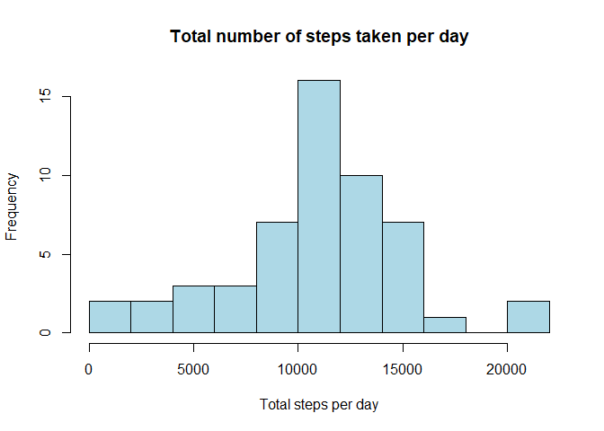
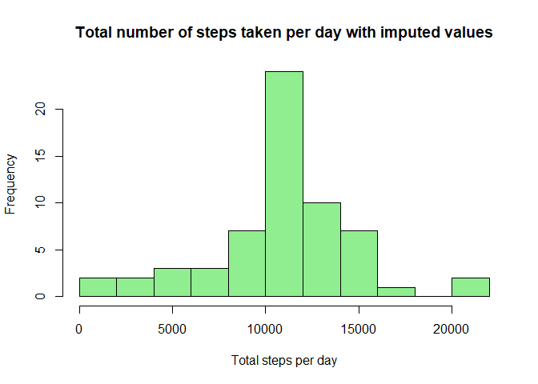
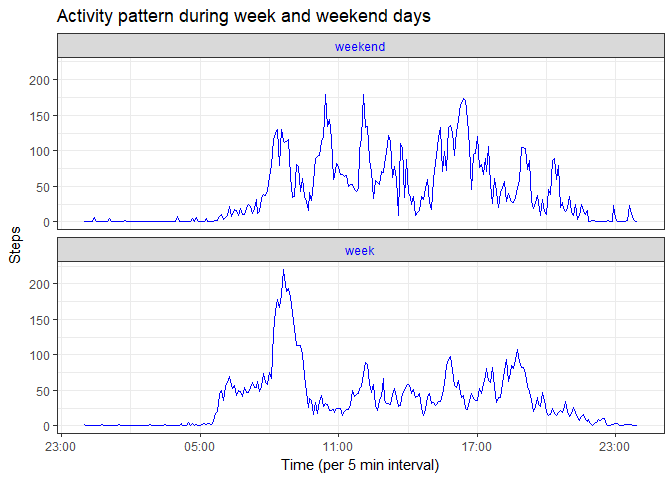

# Peerreviewed Assignment 1 Reproducible Research: Personal Activity Report
G. Hol  
September 8, 2017  
****

Summary: For the peerreviewed Assignment 1 of the Coursera "Reproducible Research" an activity dataset has been analysed. The dataset contains the number of steps taken each 5 minutes by an unnamed individual, recorded for the duration of two months in total. The separate parts of the analysis are described individually. All code chunks and plots are shown below.


**1. Loading and preprocessing the data**

```r
activity<-read.csv("activity/activity.csv", header=T)
newtime<-seq(ISOdatetime(2012,10,1,0,0,0,tz="UTC"), ISOdatetime(2012,11,30,23,55,0,tz="UTC"),by=(60*5))
activityext<-cbind(activity,newtime) #allows for better plotting of time on x-axis
fileurl<-"https://github.com/GeraHol/RepData_PeerAssessment1/blob/master/activity.zip"
dataDownloaded<-Sys.time() 
```
 
At 2017-09-08 15:48:34 the data were downloaded from https://github.com/GeraHol/RepData_PeerAssessment1/blob/master/activity.zip and manually extracted to activity.csv.


**2. What is the mean total number of steps taken per day?**

```r
stepsday<-aggregate(activity$steps, list(Date=activity$date), FUN=sum)
hist(stepsday$x, xlab= "Total steps per day", main = "Total number of steps taken per day", breaks = 10, col = "lightblue")
```

<!-- -->

Fig. 1. The average total number of steps taken per day by an individual in October and November 2012


```r
mean<-as.integer(mean(stepsday$x, na.rm=TRUE))
median<-median(stepsday$x, na.rm = TRUE)
```

The mean total steps per day is 10766, while the median is very similar with 10765 steps per day 

**3.What is the average daily activity pattern?** 


```r
stepsinterval<-aggregate(activityext[,-2], list(Interval=activityext$interval), FUN=mean, na.rm=TRUE)
```


**4. Imputing missing values**


```r
missingvalues<-sum(is.na(activity))
```

The activity dataset has 2304 missing values, all of them due to missing steps data

As strategy to impute the missing data the mean number of steps for that time interval is chosen. 


```r
newdata<-vector(length=length(activityext$steps))
for (i in 1:length(activityext$steps)){
        if(activityext$steps[i] %in% NA){
                newdata[i]<-subset(stepsinterval$steps,
                                   stepsinterval$Interval==activityext$interval[i]) 
        } else {
                newdata[i]<-activityext$steps[i]  
        } 
}
```


```r
stepsdayimputed<-aggregate(newdata, list(Date=activity$date), FUN=sum)
hist(stepsdayimputed$x, xlab= "Total steps per day", main = "Total number of steps taken per day with imputed values", breaks = 10, col = "lightgreen")
```

<!-- -->

Fig. 3. The total number of steps per day, as figure 1, only now including imputed values for those that were missing earlier


```r
meanimp<-as.integer(mean(stepsdayimputed$x))
medianimp<-as.integer(median(stepsdayimputed$x))
```

The mean total steps per day after including imputed values is 10766, while the median is exactly the same with 10766 steps per day. This is the result of adding 8 average days for the 8 missing days in the dataset, clearly the frequency of average days increased. Thus the impact of imputing values appears relatively small, compared to the original dataset including missing values. Only the median shifted by a day, after rounding. .

**4.Are there differences in activity patterns between weekdays and weekends?**


```r
newdate<-weekdays(as.Date(activity$date))
weekd<-vector(length=length(activity$date))
for (i in 1:length(activity$date)){
        if(newdate[i]=="Sunday" | newdate[1]=="Saturday"){
        weekd[i]<-"weekend"
        } else {
        weekd[i]<-"weekday"
        }
}

brandnewdata<-cbind(activityext, newdata, weekd)
```


```r
stepsintervalweek<-aggregate(brandnewdata[,-c(1,2,6)], list(Interval=brandnewdata$interval, daytyp=(brandnewdata$weekd=="weekday")), mean)
library(plyr)
stepsintervalweek$daytyp<-revalue(as.factor(stepsintervalweek$daytyp), 
                                  c("TRUE" = "week", "FALSE" = "weekend"))
library(ggplot2)
g<-ggplot(stepsintervalweek, aes(rep(stepsinterval$newtime,2), stepsintervalweek$newdata))
g+geom_line(color="blue") + theme_bw()+ facet_wrap(~stepsintervalweek$daytyp, ncol=1) + labs(title="Activity pattern during week and weekend days") +labs(x="Time (per 5 min interval)" , y="Steps")+theme(strip.text.x = element_text(colour="blue"))+scale_x_datetime(date_labels="%H:%M")
```

<!-- -->

Fig. 4. The daily activity pattern clearly varies between weekdays and weekenddays

Weekdays have a clear peak activity early in the morning, while activities during weekend days seems more even distributed over the day with multiple, smaller peaks

